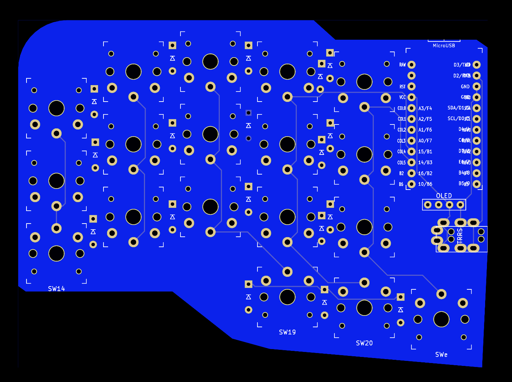

# Crab PCBs

Behold. Here are some really basic PCBs that only support kailh choc low profile switches.

Currently they all have 36 keys, which I consider to be as small as a keyboard can be without resorting to chording or other shenanigans.

These are the first keyboard pcbs I have every made, so proceed with caution, and a little aprehension.

These are heavily influenced by the following keyboards, and actually based on foostan's simple corne pcb.

* 5plit
* Gergoplex
* crkbd
* Kyria
* Jian/Jorne/Jorian

## Caseless

These are all supposed to be used caseless and have no holes for cases or anything fancy.

## Firmware

All these pcbs can used the crkbd firmware. 

## Why crab? 
Crab is the alternate name for the medium invader, from space invaders, which the original board superficially resembled.

## Pics

